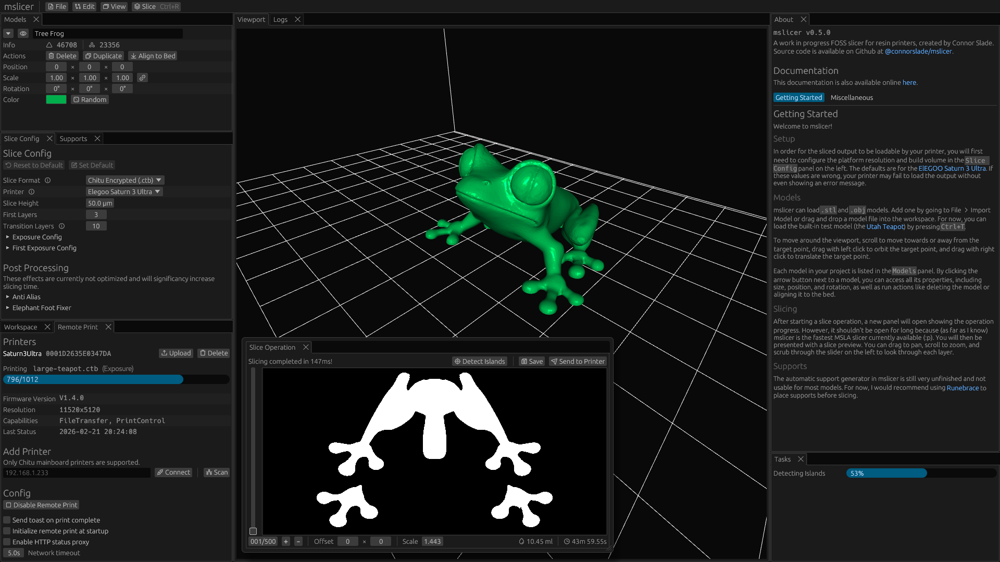
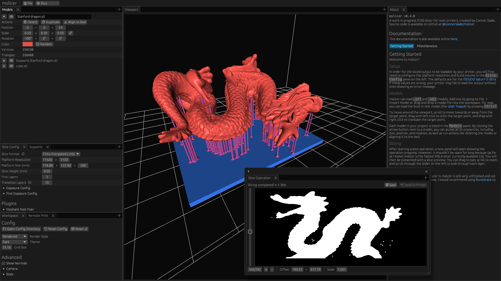

A high-performance, open-source slicer for {{details(body="MSLA", desc="Masked stereolithography.\nUses an LCD mask to cure entire layers of resin at once.")}} resin printers.
Compatible with printers that support any of the following file formats: Chitu (.ctb), Elegoo (.goo), or NanoDLP (.nanodlp).

<div class="screenshots">
    
    
    <div class="screenshot-selector">
        <label><input type="radio" name="screenshot" id="sb-1" checked /> 1</label>
        <label><input type="radio" name="screenshot" id="sb-2" /> 2</label>
    </div>
</div>

## Features

mslicer is still in development and is not yet at feature parity with commercial slicers.
There is still work to be done on support structure generation and optimized/3D anti-aliasing, but this section outlines some of it's more unique features.

### Open Source and Private

There aren't really any open-source slicers for resin printers.
Most existing options are closed-source, expensive, slow, require accounts, limit usage, don't support Linux, or even have built-in ads.
mslicer exists to be the opposite of that.
It's fully open source ([GPL-3.0](https://www.gnu.org/licenses/gpl-3.0.en.html)) and will never include any analytics or require an account.

This also makes experimentation and research easier, something that's been common in FDM printing, but missing in the resin printing world due to lack of accessible and hackable tooling.

### Performance

In my [(unscientific) testing](https://files.connorcode.com/Documents/mslicer/speed-chart.pdf), I've found that mslicer is often 20 to 120 times faster than competing slicers (crazy right‽).
For most use-cases this is just makes your workflow a little smoother, but with super high-poly models mslicer might be the only tool capable of the job.

This is achieved with multithreading, acceleration structures, and by slicing directly into the compressed formats used by MSLA file formats.
You can read more about how it works on my personal website's [mslicer project page](https://connorcode.com/projects/mslicer).

### Remote Print

Inside of mslicer you can connect to Chitu-mainboard printers on your network and remotely start and monitor prints.
No other slicers have this functionality completely built-in.

## Installation

### Stable Releases

The latest stable version [v{{config(key='version')}}](/docs/changelog), was released on {{ config(key='release-date') }}.

<div class="downloads" >
    <div>
        <h4>Linux</h4>
        <ul>
            <li><a href="https://github.com/connorslade/mslicer/releases/download/{{ config(key='version') }}/mslicer-x86_64-unknown-linux-gnu">Binary (x64)</a></li>
            <li><a href="https://flathub.org/en/apps/com.connorcode.mslicer">Flathub</a></li>
            <li><a href="https://search.nixos.org/packages?channel=unstable&query=mslicer&show=mslicer">Nixpkgs</a></li>
        </ul>
    </div>
    <div>
        <h4>Windows</h4>
        <ul>
            <li><a href="https://github.com/connorslade/mslicer/releases/download/{{ config(key='version') }}/mslicer-x86_64-pc-windows-msvc.exe">Binary (x64)</a></li>
        </ul>
    </div>
    <div>
        <h4>MacOS</h4>
        <ul>
            <li><a href="https://github.com/connorslade/mslicer/releases/download/{{ config(key='version') }}/mslicer-aarch64-apple-darwin">App (Intel)</a></li>
        </ul>
    </div>
</div>

### Development Builds

The latest development builds are available for Linux, Windows, and MacOS on [Github Actions](https://github.com/connorslade/mslicer/actions/workflows/build.yml?query=branch%3Amain%20is%3Asuccess).
Just open the workflow run and download the correct artifact for your system.

### From Source

If you would rather build from source, just have the latest stable version of the [Rust toolchain](https://rustup.rs/) installed and build the binaries you want (mslicer, slicer) as shown below.

```bash
git clone https://github.com/connorslade/mslicer
cd mslicer
cargo build --release --package mslicer
```

<style>
    .downloads {
        display: grid;
        grid-template-columns: repeat(auto-fit, minmax(250px, 1fr));
        gap: 16px;
        margin: 20px 0;
    
        & > div {
            & > h4 {
                display: flex;
                gap: 4px;
    
                margin-top: 0;
                border-bottom: 2px solid #e0e0e0;
                padding-bottom: 8px;
    
                & > img {
                    width: 1em;
                }
            }
    
            & > ul {
                list-style: none;
                padding-left: 0;
    
                & > li {
                    margin: 8px 0;
    
                    &::before {
                        content: "→ ";
                    }
                }
            }
        }
    }
    
    .screenshot-selector {
        display: flex;
        justify-content: center;
        position: absolute;
        transform: translateY(calc(-100% - 4px));
    
        & > label {
            border: 1px solid #ddd;
            border-bottom: 2px solid #ddd;
            padding: 8px;
            cursor: pointer;
            background: #f5f5f5;
            transition:
                background 0.15s ease,
                border 0.15s ease;
    
            &:has(input:checked) {
                background: #e0e0e0;
                border-bottom: 2px solid #000;
            }
    
            &:has(input:focus-visible) {
                outline: 2px solid #000;
            }
    
            &:hover {
                background: #e8e8e8;
            }
    
            &:active {
                background: #d0d0d0;
            }
    
            & > input {
                opacity: 0;
                position: absolute;
                pointer-events: none;
            }
        }
    }
    
    body:has(input#sb-1:not(:checked)) #s-1,
    body:has(input#sb-2:not(:checked)) #s-2,
    body:has(input#sb-3:not(:checked)) #s-3 {
        display: none;
    }
</style>
