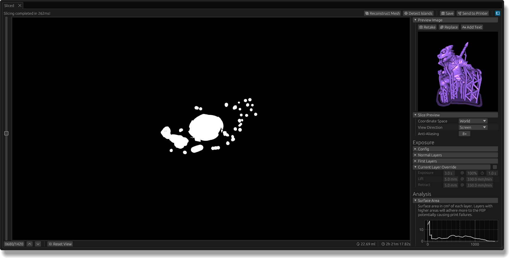
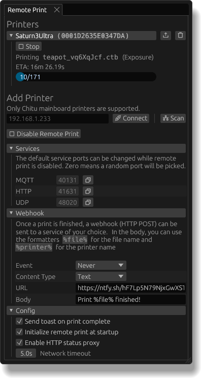
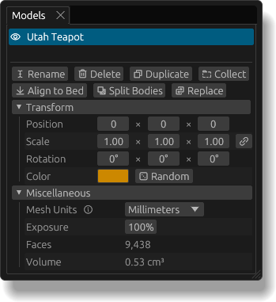

Welcome to mslicer!
I'll try to give a good overview of the program in this document.
If you run into any bugs or just have feature requests, please don't hesitate to make an [issue on GitHub](https://github.com/connorslade/mslicer/issues/new) or [contact me](https://connorslade.com/#:~:text=will%20enjoy%20this.-,Contact,-If%20you%20have) directly.

    
<strong>Contents</strong>

- [Installation](#installation)
  - [Linux](#linux)
  - [Windows](#windows)
  - [MacOS](#macos)
- [Setup](#setup)
- [Models](#models)
- [Slicing](#slicing)
- [Remote Print](#remote-print)
  - [Completion Notifications](#completion-notifications)
- [Appendix](#appendix)
  - [Model Properties](#model-properties)
  - [Model Warnings](#model-warnings)
  - [Slice Config](#slice-config)
  - [Custom Presets](#custom-presets)
  - [Mesh Reconstruction](#mesh-reconstruction)
  - [Spacenav](#spacenav)

## Installation

Feel free to skip this section if you have already installed mslicer, but do note that not all installation methods will register file associations and create a launcher entry.
Downloads are available [here](/#installation:~:text=completely%20built%2Din.-,Installation,-Stable%20Releases).

### Linux

On Linux-based systems, mslicer can be downloaded as a single binary or installed through Nixpkgs or Flathub.
I would recommend using the Flatpak if possible since it automatically sets up file associations (so you can double-click a `.mslicer` project file in your explorer to open it in mslicer) and a launcher entry.

### Windows

Windows releases are distributed as plain `.exe` files that function as both an installer and a portable executable.
The first time you run it, you will see a dialog box (screenshot below) asking if you want to install or just run.
As it says in the dialog, installing will add to the Start menu and register file associations.

If you choose to run portably and later decide to install it, you can do so through the `File › Misc › Install` button.

### MacOS

On macOS, just download the version for your system architecture (Intel or Apple Silicon), extract the zip archive, and move the `.app` bundle to your `Applications` folder.
File associations don't currently work on macOS.

## Setup

The interface is made up of many panels that can be moved and reconfigured however you want.
Use the `View` toolbar menu to hide or show specific panels or reset the layout to the default.

The most important setting to change is your printer in the `Slice Config` panel.
You can use one of the presets if you have an Elegoo or Phrozen printer; otherwise you will need to select `Custom` and fill in the build volume size and LCD resolution manually (or [create your own preset](#custom-presets)).
If the build volume is not correct you will get inaccurate printed dimensions, and if the resolution is wrong your printer may fail to load the output without even showing an error message!

If you have a 3Dconnexion device and want to get that working in mslicer, see [Spacenav](#spacenav).

## Models

mslicer can load `.stl` and `.obj` meshes.
Add one by going to `File › Import Model` or drag and drop a mesh file into the workspace.
Not all meshes are created equal, though; some (especially those downloaded from the internet) have issues like holes, inconsistent winding order, un-welded seams, etc., which can cause unexpected errors while slicing.
If you encounter this issue or see the 'Non Manifold Mesh' [warning](#model-warnings), see [Repairing Non-Manifold Meshes](/docs/non-manifold-meshes).
For now, you can also load the built-in test model (the [Utah Teapot](https://en.wikipedia.org/wiki/Utah_teapot)) by pressing `Ctrl+T` or `⌘+T` on Mac.

To move around the viewport, scroll to move towards or away from the target point, drag with left click to orbit the target point, and drag with right click to translate the target point.
You can also switch between the default perspective camera and an orthographic camera in the workspace panel.

Each model in your project is listed in the `Models` panel.
By clicking a model in the 3D view or the Models panel, you can access all its properties, including size, position, and rotation, as well as run actions like deleting the model or aligning it to the bed (see [Model Properties](#model-properties) for a complete description).

Since mslicer's automatic and manual support placement features are still under development and not usable for most models, use the method described in the [Support Placement](/docs/support-placement) page.

<!-- mention auto layout -->

## Slicing

For a full description of the 'Slice Config' parameters see [Slice Config](#slice-config).
The most notable one, 'Anti Aliasing', uses 3D supersampling anti-aliasing (SSAA) to pick grayscale values that more accurately represent the actual model geometry.
The actual value of this setting is the number of effective samples per voxel.

Start a slice operation with the 'Slice' button on the top bar or `Ctrl+R` (`⌘+R` on Mac).
Slicing shouldn't take long because (as far as I know) mslicer is the fastest MSLA slicer currently available (:p).
You will then be presented with a slice preview.
You can drag to pan, scroll to zoom, and scrub through the slider on the left to look through each layer.

The top bar of this panel lets you save to a `.goo`, `.ctb`, or `.nanodlp` file, send to a printer wirelessly (see [Remote Print](#remote-print)), detect islands, or reconstruct a mesh.
Islands are clusters of voxels that are not supported from below and can't be printed properly.
After detecting islands, look for any red layers on the left slider and red voxels within those layers.
[Mesh reconstruction](#mesh-reconstruction) is intended for re-slicing a model if you only have a sliced file and don't have the original mesh.

The sidebar exposes tools for modifying and analyzing sliced files generated in mslicer or loaded from disk (`File › Load Sliced`, `Ctrl+Shift+I`, or `⌘+Shift+I` on Mac):

- **Preview Image** &mdash; Allows generating a new image from whatever is currently visible in the 3D workspace, replacing the image with one from disk, or overlaying custom text.
- **Slice Preview** &mdash; Configuration for the slice preview itself.
  Many resin printers have rectangular (non-square) LCD pixels, which means if the preview uses square pixels (Screen Space) the image will appear stretched.
  The view direction lets you flip the slice preview to see how it would look on either the LCD screen or the build plate after flipping it upright.
  Finally, anti-aliasing improves the visual fidelity when zooming out (and multiple printer pixels are covered by a single pixel on your screen).
- **Changing Exposure Settings** &mdash; You can load an existing sliced file and change the exposure settings for normal layers, first layers, or make exposure overrides on individual layers.
  The exposure override can also be useful for files sliced in mslicer, as it gives you super fine control of exposures.
  For example, if you want to combat the elephant foot effect by increasing the rest times for some of the layers after the first layers.
- **File Analysis** &mdash; You can view a plot of the surface area of your sliced file.
  This can be useful as large surface areas or big decreases in surface area can indicate that a lot of force will be required to lift the build plate and print failure could occur.
  I plan to add some more analysis types here in the future.

## Remote Print

If you are using a printer with a Chitu mainboard, you can wirelessly start and monitor prints.
Specifically, those that support {{details(body="SDCP", desc="Simple device control protocol. Created by Chitu systems for their mainboards.")}} v1.0 and v3.0 (there is no v2 for some reason), including the Saturn 3 / 4 series.

Depending on your system, you may need to first change your firewall settings.
You can either allow connections on the ports after they have been randomly picked or set and unblock default ports; check the 'Services' dropdown in the `Remote Print` panel.
On Fedora Linux this can be done easily with `sudo systemctl stop firewalld.service`.

To add a printer, first click on 'Initialize' in the `Remote Print` panel, then either scan for printers on your network or connect to one using an IPv4 address.
You will then be able to send prints from the `Sliced` panel or upload sliced files to the printer directly with the little upload button.
You can also remotely stop and pause prints (note that pause is currently only supported on printers using the v3.0 protocol).

### Completion Notifications

There are two ways you can get notified when a print finishes: desktop notifications and webhooks.
Desktop notifications are the simplest to use; just check the 'Send toast on print complete' checkbox under 'Config'.

But if you want to (for example) get a push notification on your phone instead, you can use webhooks with a service like [ntfy](https://docs.ntfy.sh), [brrr](https://brrr.now), or even [Discord](https://discord.com).
Webhooks are just HTTP POST requests to whatever URL you want; you can configure one through the 'Webhook' dropdown (make sure to change the 'Event' to 'Print Completion').
You can use a plain text or JSON body with the following formatters: `%file%` for the name of the file that just finished and `%printer%` for the name of the printer.

There is also an HTTP status proxy that you can read more about at [Remote Print HTTP Status Proxy](/docs/remote-print-proxy).

And that's it 😅.
If you happen to be interested in home PCB fabrication, also check out [PCB Photolighography](/docs/pcb-photolighography) to learn how to use mslicer and a resin printer to improve the process.

## Appendix

### Model Properties

In the 'Model' panel there are actions, properties, and some mesh statistics. Starting with the actions:

- **Rename** &mdash; Allows you to change the name of a model
- **Delete** &mdash; Deletes a model
- **Duplicate** &mdash; Duplicates a model. Internally this uses {{details(body="instancing", desc="Only store the triangle mesh and acceleration structures once, referenced in each instance.")}} so it's much more efficient to duplicate a model compared to loading its mesh again.
  There is also a tool, `Tools › Collect Instances`, that creates new collections grouping all instances of the same mesh.
- **Collect** &mdash; Creates a new collection (group of models) with the currently selected model.
- **Align to Bed** &mdash; Changes the model's Z position so that its lowest point rests on the build plate.
- **Split Bodies** &mdash; Some meshes contain multiple shells/components; this action separates them into their own models.
- **Replace** &mdash; Lets you select a new mesh from the filesystem to replace the active model without resetting any model properties.
- **Reload** &mdash; If you loaded a model in the current session, you will also be able to replace it with a new version of the file you loaded. This is useful when iterating on a design. (Not in screenshot)

If you select multiple models at the same time by shift-clicking them in either the 3D view or the `Model` panel, the delete, collect, and duplicate actions will still be available.

The position and scale properties are specified in XYZ coordinates and the rotation in Euler angles: roll, pitch, yaw (applied in that order).
The little link button next to scale lets you set nonuniform scales.

Because meshes stored as `.stl` or `.obj` files don't have unit metadata, mslicer just assumes they use millimeters, but not all tools output meshes in that format.
If your mesh uses some other unit you can select one of the presets from the dropdown (millimeters, centimeters, meters, inches) or enter a custom conversion factor that multiplies the mesh units to get millimeters.

The exposure percent lets you set a lower exposure for individual models, which could be useful for exposure tests.
In the case that two models with different exposure values overlap, the higher exposure will take precedence.

Faces is the number of triangles that make up the mesh, and volume is the volume of the mesh considering any scale factor you apply.

### Model Warnings

Mesh warnings appear as a small warning icon by the model name in the `Models` panel.
There are currently two warnings.

- **Non Manifold Meshes** &mdash; The mesh is invalid and may produce unexpected results when slicing. See the [Models](#models) section for more details.
- **Out of Bounds** &mdash; The model extends beyond the printer's build volume and will be cut off.

### Slice Config

You can set a global default slice config and reset to it at any point with the buttons at the top of the panel.
Note that your slice config is saved to mslicer projects.

- **Slice Mode** &mdash; mslicer can output slices either as raster layers for MSLA printers or vectors that (for example) can be used with a craft cutter (niche use case but I've made some cool things with it).
- **Printer** &mdash; Defines the build volume and LCD resolution for your printer.
- **Slice Height** &mdash; The height of each slice. Note that the slice will be taken at the center of each layer.
- **Anti Aliasing** &mdash; Uses grayscale values that more accurately represent the actual model geometry.
  The value of this setting is the number of effective samples that get averaged per voxel.
  Unlike other slicers, this is calculated in 3D, which helps reduce the visibility of steps between layers.
- **First Layers** &mdash; For improved build plate adhesion, it is common to have much higher exposures for the first few layers.
  This setting controls how many layers use the 'First Layers' exposure config.
- **Transition Layers** &mdash; To get a more even look, you can add some number of layers after the 'First Layers' that interpolate the exposure to its normal setting.

The 'Normal Layers' and 'First Layer' exposure configurations have the same properties:

- **Exposure** &mdash; Exposure is defined by time and intensity. The first value is the length of the layer exposure; the second value is the intensity (in percent of your printer's maximum output power).
  The third value is an exposure delay, which lets the resin settle before exposing.
  Increasing the exposure delay significantly will reduce the elephant foot effect.
- **Lift** &mdash; Distance and speed to lift the build plate after each exposure.
- **Retract** &mdash; Has the same distance as lift, possibly a different speed.

Exposure remapping lets you define a curve (using Bézier handles) that maps exposure values.
This can be useful when using anti-aliasing since fractional exposure values don't necessarily correspond linearly to voxel growth.

There are also some additional postprocessors that I won't get into here: Variable Layer Height and the (legacy) Elephant Foot Fixer.

### Custom Presets

If your printer is not one of the default presets, you can create your own!
Feel free to also make a GitHub issue to get your printer config added to the default.
Open the preset edit window with the pencil icon next to the printer setting in `Slice Config`.

Here you can create new presets, delete them, change their names, and, of course, configure their build volume and resolution.

### Mesh Reconstruction

If you happen to have a sliced file and you want to convert it back to a mesh to re-slice or something, you're in luck!
After loading a sliced file (or slicing something) you can press the 'Reconstruct Mesh' button in the `Sliced` panel, select a resolution (coarse, fine, or exact), and get the reconstructed mesh loaded into your project.

The image is the Stanford dragon recreated from a sliced file at coarse fidelity.
It looks pretty good for being downsampled so much (20× at coarse), but you can see some artifacts, especially in areas with lower curvature.
Do note that since every voxel can create multiple triangles in the reconstructed mesh, the poly count will be enormous even at lower fidelity. This example resulted in over 3.3M faces.

### Spacenav

mslicer supports controlling the camera (and running some predefined shortcuts) with a 3Dconnexion device.
This is currently only supported on Linux through the [Spacenav](https://spacenav.sourceforge.net/) library.
To get it working, install the driver, start mslicer, and you should see 'Connected to Spacenav.' in the 'Spacenav' menu in the `Workspace` panel.
