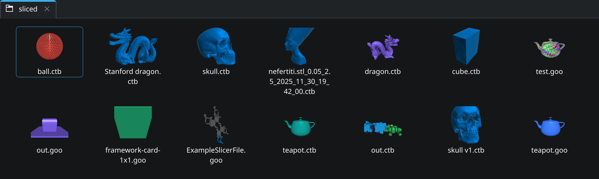

This KDE plugin provides thumbnail support for sliced MSLA file formats on Linux, including `.goo`, `.ctb`, and `.nanodlp` files.
It displays the embedded preview images as the file icons (using the mslicer format implementations).

Check it out on Github at [@connorslade/msla-thumbs](https://github.com/connorslade/msla-thumbs).

## Installation

First you will need to register the `.goo`, `.ctb`, and `.nanodlp` formats on your system.
Download the XML files in [plugin/mime](https://github.com/connorslade/msla-thumbs/blob/main/plugin/mime) and [register them](https://unix.stackexchange.com/a/564888) on your system.

Next, download `msla-thumbs.so` from the [latest release](https://github.com/connorslade/msla-thumbs/releases) and copy it to `/usr/lib64/qt6/plugins/kf6/thumbcreator/`.
If using the Dolphin file browser, you will need to enable showing 'Sliced MSLA previews' in Configure › Interface › Previews.
