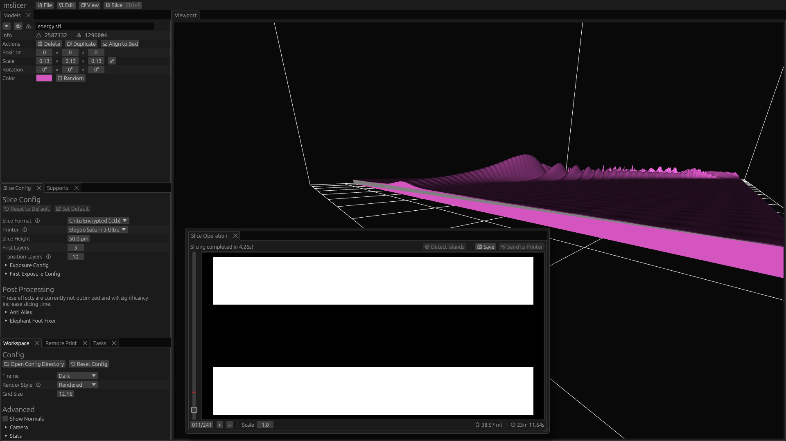

A [mon-manifold mesh](https://blender.stackexchange.com/a/7914) contains geometry that cannot exist in the real world.
Sometimes meshes (especially downloaded from the internet) can be invalid due to disconnected faces/edges/verticies, internal faces, or inconsistent winding order.
mslicer is not currently able to handle these kinds of invalid meshes and may produce unexpected results when sliced.

## Example

In this model, some triangles have a reverse winding order (colored gray) which causes the slicer to give an incorrect output as if those faces are completely ignored.

## Repair Tools

Below are a some mesh processing tools that can repair non-manifold or invalid meshes.
I have generally had better luck with the paid tools (they have free trials), but you will need to experiment a bit to see which tools are able to fix your specific mesh.

### Paid

- [Mesh Inspector](https://meshinspector.com)
- [Mathematica](https://www.wolfram.com/mathematica) ([RepairMesh](https://reference.wolfram.com/language/ref/RepairMesh.html) function)

### Free

- [MeshLab](https://www.meshlab.net)
- [Mesh Repair Tools](https://extensions.blender.org/add-ons/mesh-repair-tools) (Blender Addon)
- [Runebrace](https://www.tarabella.it/Runebrace)
