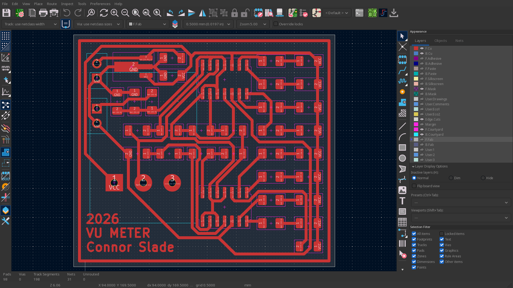
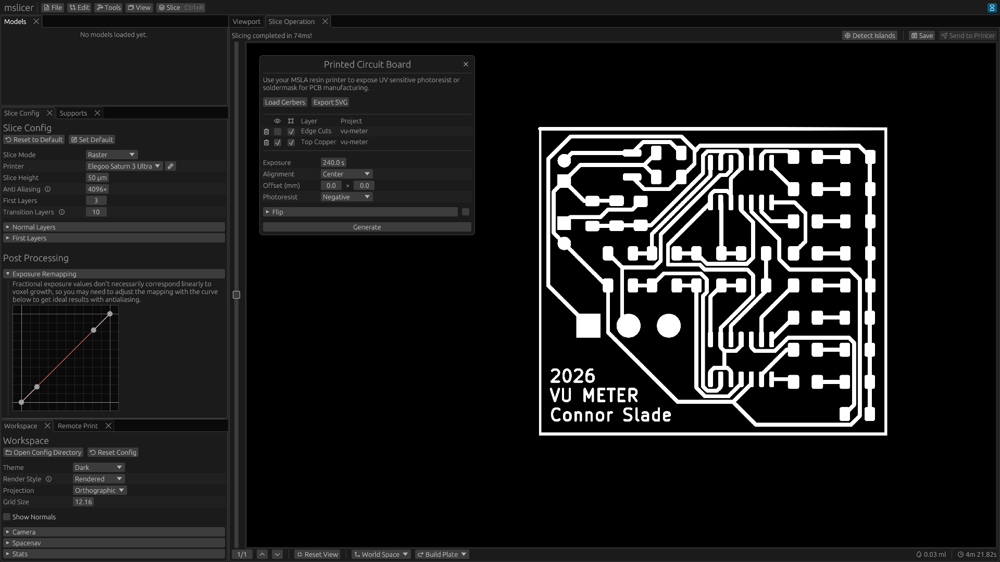

<link
rel="stylesheet"
type="text/css"
href="https://cdn.jsdelivr.net/npm/@phosphor-icons/web@2.1.1/src/regular/style.css"
/>

Prototyping PCBs with a professional Fab can take weeks per iteration, for some cases this is fine but you can make your own in under an hour at home!
The two main ways to make a PCB are CNC milling and etching.
This article is about etching and how the traditional method can be improved with a MSLA printer (and mslicer of course).

On the right is a video of one of the simpler PCBs I've made, its a simple VU-meter style audio visualizer.
I will use it as an example in the later sections.
Song is Destiny by Thaiboy Digital btw.

## Process Overview

In order to chemically etch the copper from a copper clad board in your desired pattern, you need some kind of mask.
Photoresist is a UV light sensitive material that once exposed and developed, leaves a coating in your desired shape that blocks the etching processing.
There are five main steps to etch a PCB:

<video src="https://files.connorslade.com/Video/vu-meter.mp4" controls style="width: 100%"></video>

### 1. Apply Photoresist

You can either buy pre coated copper clad (which is kinda difficult to source) or get dry film photoresist, which comes on a roll and must be applied to each board.

I've been using the dry film, which works great as long as you get it it applied correctly.
First sand the copper a bit with a Scotch-Brite pad to clean and make some texture for the photoresist to stick to (make sure to clean off the dust from sanding with {{details(body="IPA" desc="Isopropyl alcohol")}}).
Then cut a square of the photoresist a bit larger than your copper clad, peal the protective film off once side (with two pieces of tape) and stick it down using a credit card to get out any air bubbles.
Cut off the excess around the edges and run it through a hot laminator a few times to get the best adhesion.

### 2. Exposure

This is where the MSLA printer comes in!
In order to transfer your pattern from a gerber file to the photoresist, it needs to be exposed with ~400nm UV light which is the same as what UV curing resin uses!
I'll discuss the details of how to get your resin printer to display a gerber file using mslicer in the [Exposing the Photoresist](#exposing-the-photoresist) section.

Remove the resin vat and place your copper clad photoresist down onto the LCD.
I've gotten the best results by removing the second layer of protective film before exposure.
You will need to do some testing to figure out the optimal exposure time for your specific setup, but it will probably be about 4 minutes.

### 3. Development

After exposure (with negative photoresist) the unexposed areas will need to be chemically removed with Sodium Carbonate, which is sold as a household cleaning product.
I've gotten great results with a 4% by weight solution of the sodium carbonate in water, heated in the microwave for 30 seconds.

Constant agitation is critical for getting consistent development, lightly shaking the container works fine since this step only takes about three minutes.
Once all the unexposed photoresist has dissolved, rinse in water.

### 4. Etching

For etching there are a few options, but I've been using Ferric Chloride.
First warm it in the microwave (making sure not to heat above 55°C or 131 °F) then submerge your board and agitate until the etching completes, which takes about 20 minutes.
You could agitate manually, but I got better results with a contraption I built with a drill and some cardboard.
After etching rinse in water.

### 5. Photoresist Removal

Finally, submerge in a 4% by weight solution of Sodium Hydroxide and water.
After a minute or so the exposed photoresist will lift right off.
Rinse in water, drill holes for any through-hole components, cut the board to its final size and you're done!

## Exposing the Photoresist

Once you have your PCB design (I use KiCad btw) export at least the front copper and edge cuts layers to Gerber files (also back copper if you're doing double sided).
Edge cuts define the edges of your PCB, which is important for positioning.

In mslicer, the open the PCB tool from the '<i class="ph ph-hammer"></i> Tools' dropdown in the top bar.
Select 'Load Gerbers' and select the copper and edge cuts layers.

Each layer has two check boxes, layer visibility (<i class="ph ph-eye"></i>) and weather its considered part of the bounding box (<i class="ph ph-bounding-box"></i>).
The bounding box is used to position your gerber in the 2D coordinate system of the LCD.
Whichever alignment point you select (Top Left, Center, Bottom Right, etc.) that point on the gerber is positioned at that point on the LCD.
For example with center alignment, the center of the bounding box will be positioned at the center of the LCD.

Set the alignment to 'Center' and click generate!
This will create a single layer exposure inheriting the global slice config, meaning you can enable antialiasing and set an exposure curve.
I've gotten good results with 4096× antialiasing and a linear exposure curve, I think this is because it underexposes the edges of traces somewhat compensating for unwanted light spread.

Position your copper clad on the printer and start the print job.

</img>

### Double Sided Boards

In order to expose two sides of the board with perfect alignment you need to match the flip axis in real life with the axis you set in software.
This is only really possible with some kind of jig to locate the board over the LCD.
There are of course many ways to do this and it's slightly different for each printer, but I would recommend making something that aligns with the same divots the resin vat sits in with a rectangular opening centered over the LCD.

To calibrate, tape a piece of the photoresist film to the bottom of it and create/expose a gerber that's just a rectangle the same size as the opening in your jig.
You can then measure the position and rotational offset and enter that into the PCB tool.

The flip axis is defined starting at the flip alignment (alignment setting in the flip dropdown) and extending at the set angle (which is relative to the positive X axis).
The flip offset shifts the axis away from the alignment point in the direction normal to the flip axis.
It's a bit complicated but hopefully the graphic helps a bit.

</img>

## Resources

If you encounter any bugs in mslicer please [open an issue](https://github.com/connorslade/mslicer/issues/new/choose) on Github, if you have any question feel free to [reach out](https://connorslade.com/#contact:~:text=Contact).

Here are some links to other pages with good information on this topic:

- [How To Expose Printed Circuit Boards With a 3D Resin Printer](https://photonics.engr.uga.edu/pcbs_with_3dprinter/index.html)
