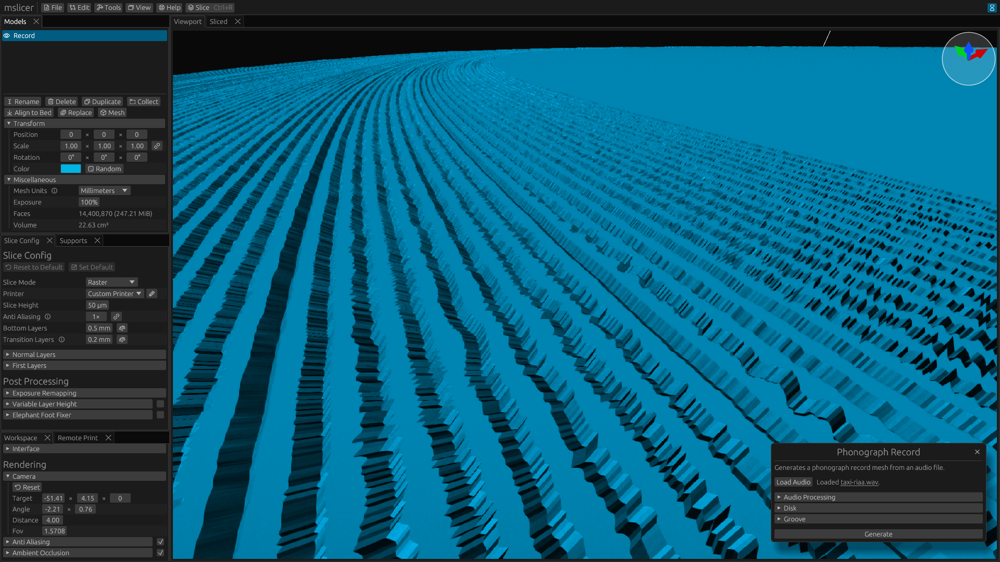

<link
rel="stylesheet"
type="text/css"
href="https://cdn.jsdelivr.net/npm/@phosphor-icons/web@2.1.1/src/regular/style.css"
/>

> Note that the generator tool featured in this document is not in the current release of mslicer.
  Either wait for the next release (v0.10.0), or download a development build if you want to try it out now.

Resin printers allow manufacturing parts with very small feature sizes, down to about 25μm (XY) on a standard consumer-grade printer.
The groove on a standard phonograph record is about 80μm wide, there's not much wiggle room, but it's possible to 3D print records.
Although you shouldn't expect very good sound quality.

There is no real use case for this, but it's just kinda cool.
Yes, that was my entire reason for spending many hours working on this and adding a phonograph record generator to mslicer.

## How do Phonographs Work?

The physical encoding itself is quite straightforward.
The disk has a 90° groove cut into it about 25μm-30μm deep, the audio signal then moves the groove diagonally for each channel (see drawing on the right).
This has the effect of being backward compatible with mono phonographs because lateral displacement is the sum of both channels.

But there is another layer of encoding: RIAA equalization, which is designed to increase recording time (by reducing the average groove width) and improve sound quality.
When a record gets mastered, RIAA pre-emphasis is applied, attenuating the low frequencies and boosting the high frequencies.
On playback, this gets reversed, which also reduces the high-frequency noise from hiss or clicks.

## Generating a Mesh

In order to 3D print a phonograph record, we first need a mesh to slice, bringing us to the new '<i class="ph ph-hammer"></i> Tools › Fun › Phonograph Record' generator.
Just load a `.wav` audio file, pick your settings, click generate, and in about a second you will have a mesh!
Unlike real record lathes, this generator doesn't currently add a run-out groove or support variable pitch.
But this is just a little experiment, so that's fine.

Note that the mesh can be exported as a `.stl` or `.obj` from the models panel for use in other applications. However, since it will likely have tens of millions of faces, slicing with mslicer is your best option.
(See my rough slicing speed comparison: [Benchmark Results](#benchmark-results))

Most of the parameters are self-explanatory, but here are some descriptions of the others:

- Mesh Generation &mdash; The tool can either generate a standard manifold mesh or a simplified mesh that omits faces parallel to the slicing axis (generates and slices a bit faster, but may not work in other software).
- Resolution &mdash; The groove mesh resolution: how many audio samples are used for each second of playtime.
- Modulation &mdash; Audio gain multiplier. Can be used to change the groove width to better fit with your chosen pitch.

After all that, here is an example generated mesh.
I find it pretty cool to see a close-up view of what a phonograph record looks like!
(No scanning electron microscope needed).

## The Result

Here is a video of my first working test, the song is ["Taxi" by Charli XCX](https://www.youtube.com/watch?v=knTzS1KCjnE).
I probably should have used something more recognizable (and not unreleased), but it was just the first `.wav` file I found on my computer.

The quality is... not great, but I think it could be improved by tuning the groove settings and maybe post-processing with an ultrasonic cleaner.
I'll update this document if I get around to that... But I don't want this little side-quest taking up too much of my time.

If you try this yourself, let me know how it turned out!
Here are the settings I changed from the defaults, as a starting point:

| Setting       | Value                                                                                                                                                                                    |
| ------------- | ---------------------------------------------------------------------------------------------------------------------------------------------------------------------------------------- |
| Slice Height  | 10μm (With {{details(body="Variable Layer Height", desc="Not sure why, but my prints kept failing until I turned this on.\nCombine up to 5 layers to get 50μm layers at the bottom.")}}) |
| Anti-Aliasing | 125×                                                                                                                                                                                     |
| Pitch         | 170μm                                                                                                                                                                                    |
| Normal Layers | 2.0s (<i class="ph ph-clock"></i> 10.0s)                                                                                                                                                 |
| Bottom Layers | 10.0s (<i class="ph ph-clock"></i> 10.0s)                                                                                                                                                |

<video src="https://files.connorslade.com/Video/3d-printed-phonograph-record.webm" controls style="max-width: 431px;"></video>

## Appendix

### Benchmark Results

I thought it would be interesting to see how different slicers handle such a high-resolution model, so I did a little benchmark!
Sliced for the {{details(body="Saturn 3 Ultra" desc="Resolution: 11520×5120")}}.

Good to see that mslicer is the fastest ☺. Dragon Fruit slicer is not too far behind, although its UI was painfully slow rendering the large model.
I left ChituBox slicing for about two hours without it finishing, so I'm not sure exactly how long it would have taken, but that's actually insane compared to 4 seconds. 
<!-- i think i know why they're called CBD technologies... low key i could write better code high so... do better chitubox!! -->

<!---
- dragonfruit: 18s (23s with 16×AA)
- mslicer: 3.92s (4.84s with 16×AA) (88.96s with 256×AA, 16×3DAA)
-->
