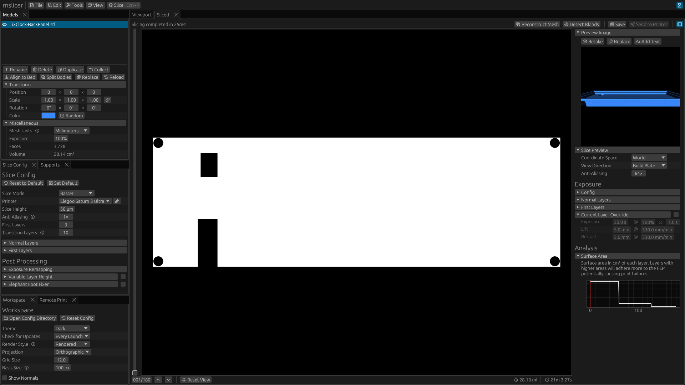
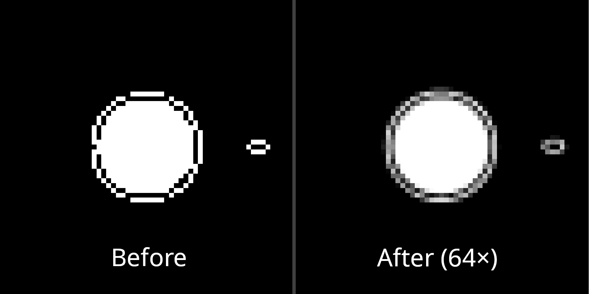
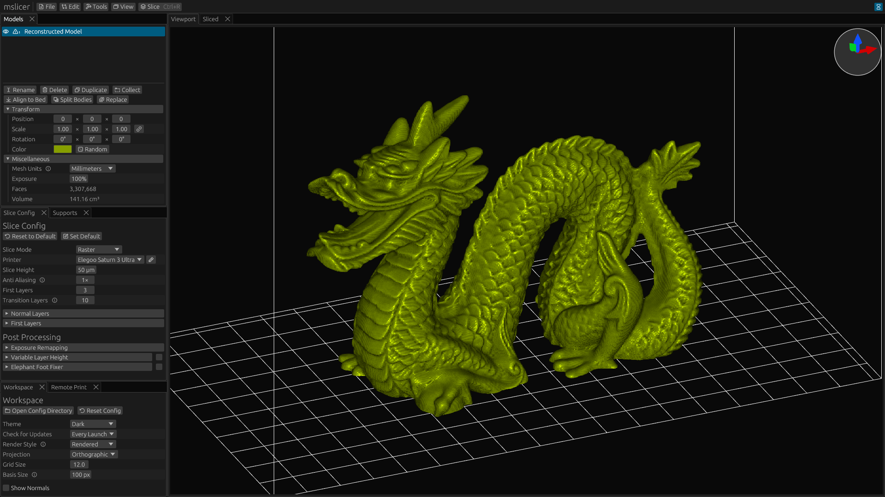
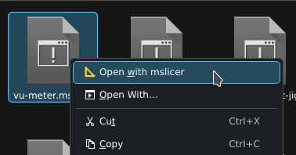
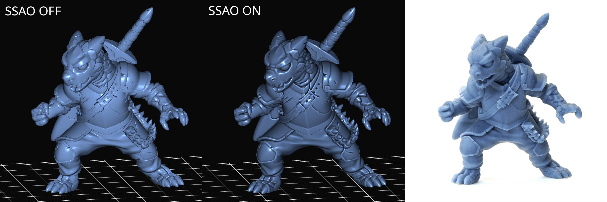
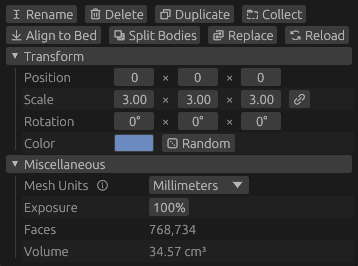
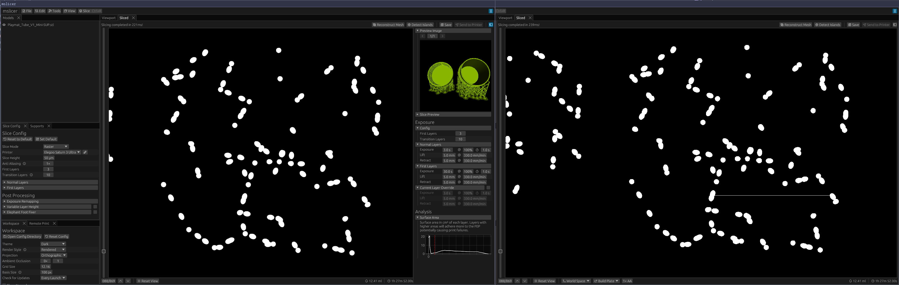

This document covers the biggest and most interesting changes, check the [changelog](/docs/changelog) for a full list of changes.

## New Features

### Sliced Window Updates

This is probably the biggest new feature of this update!
I reworked the 'Sliced' panel (previously known as the 'Slice Operation' panel).
You can now load existing sliced files, inspect, analyze, modify, and re-export them in different formats.

You can see the newly added sidebar in the image above, which currently has four uses:

- **Preview Image** &mdash; You can view the preview image for a loaded sliced file or one sliced within mslicer, replace it with your own image, or overlay text on it.
  This is mainly intended for the existing sliced files, but the text feature could be useful for new ones.
- **Changing Exposure Settings** &mdash; You can load an existing sliced file and change the exposure settings for normal layers, first layers, or make exposure overrides on individual layers.
  The exposure override can also be useful for files sliced in mslicer, as it gives you super fine control of exposures.
  For example if you want to combat the elephant foot effect by increasing the rest times for some of the layers after the first layers.
- **File Analysis** &mdash; You can view a plot of the surface area of your sliced file. 
  This can be useful as large surface areas or big decreases in surface area can indicate that a lot of force will be required to lift the build plate and print failure could occur.
  I plan to add some more analysis types here in the future.
- **Slice Preview Settings** &mdash; With more space, the coordinate space, view direction, and anti-aliasing settings can their full names listed instead of just an ambiguous icon.

The slice preview itself got some big improvements too:

- **Lag Free Preview** &mdash; In previous versions scrubbing through layers in the slice preview would cause the fps to drop to about 12.
  This turned out to be caused by the memory bandwidth needed to upload such high resolution images to the GPU.
  Now the layers are uploaded in their RLE compressed form and decompressed on the GPU(!) significantly reducing memory usage.
  Although a small improvement, this is something that very few other slicers seem to have for some reason.
  Another place mslicer is faster than the competition :p
- **Anti-Aliasing** &mdash; Previously the slice preview used nearest neighbor downsampling, which although not the prettiest mostly worked fine since most printed features are not on the scale of single voxels.
  But while debugging some slicing errors that were on the scale of single voxels, I realized that they could be obscured by the downsample.
  See the zoomed-in comparison below, it looks so much better at low scales now.

The last new feature here is the ability to convert sliced files back into meshes using Marching Cubes.
Below is the stanford dragon recreated from a sliced file at corse fidelity.
It looks pretty good for being downsampled so much (20× at corse) but you can see some artifacts especially in areas with lower curvature.

Do note that since every voxel can create multiple triangles in the reconstructed mesh, the poly-count will be enormous even at lower fidelity.
This example resulted in over 3.3M faces.

### File Associations

On Windows and Linux (when you install the flatpak) you now get system wide file associations!
This means that you can double click a `.mslicer` project file to open it instead of first opening mslicer then opening the project.
This new ability also extends to meshes (`.stl`, `.obj`) and sliced files (`.goo`, `.ctb`, `.nanodlp`).

Since flatpak handles the installation, no extra steps need to be taken on Linux.
On Windows for this to be possible, mslicer needs to be installed.
Previously mslicer could only be used as a portable application on Windows, but now on first launch it will ask if you want to install or run portably.
Installing on windows also adds mslicer to the start menu.

### Rendering Updates

In this version I completely rewrote the model rendering pipeline.
It now uses a deferred shading pipeline (instead of forward rendering) which allows for adding post processing effects like screen space {{details(body="ambient occlusion", desc="A shading technique to simulate ambient light being blocked in convex areas.")}} (SSAO).
This effect is optional and must be enabled manually in the workspace settings, but I think it makes the models look a little bit more realistic.
Due to the way I implemented the new graphics pipeline, I did drop OpenGL support. So lmk if thats a problem for you on GitHub.

In the example below, I'm using the ['Puck the Adventurer' model](https://www.tableflipfoundry.com/3d-printing/puck-the-adventurer) from Table Flip Foundry.
The photo on the right is from the models website.

I also added a new basis vector gizmo to the top right of the 3D workspace to help you understand which axis in the world a model will move, scale, or rotate by when changing values in the model panel.
It's size can be configured or it can be completely disabled in the workspace config.
Before adding it, I would often change the wrong position or rotation draggers before getting the right one, and I haven't done that as much since.

### Mesh Handling

Meshes encoded in `.stl` or `.obj` files don't have unit metadata so a default just has to be assumed.
For mslicer this is millimeters, but not all tools output meshes in that format.
Previously you would have to adjust the model scale to convert from its units to millimeters to get correct dimensions but you can now just select the unit and the correct scaling is automatically applied.

There are also now two more buttons, 'Replace' and 'Reload'.
Replace lets you select a new mesh file to replace the current one without changing any of it's settings (like position, rotation, color, etc.).
Reload lets you replace a model with the same mesh file you originally loaded it from, this is useful when iterating on a model.

## Bug Fixes

### More Robust Slicing

I think I finally found and fixed the final slicing bug.
It could very rarely cause slicing artifacts in the form of long runs of voxels with incorrect brightnesses.
The issue ended up being a subtle floating-point rounding issue where the xy position from the mesh-plane intersection would sometimes not be exactly the same (off by like 1 bit) depending on which edge of the triangle the intersection was on.
Took a little while to figure out, but ended up only being like a 6 line code change.

In the image below, notice the extra white run in the right image from before the fix compared to the fixed left version.

### Reduce Output File Size

Until now all sliced outputs were a tiny bit bigger than the should have been because for internal processing each horizontal row of pixels per layer needs to be separated, but data was not being efficiently compressed across these bounders.

### Incorrect Flatpak Permissions

If you installed mslicer through the flatpak on Linux, due to incorrect permissions remote print and spacenav support would not work.
This has now been fixed. Sorry!

