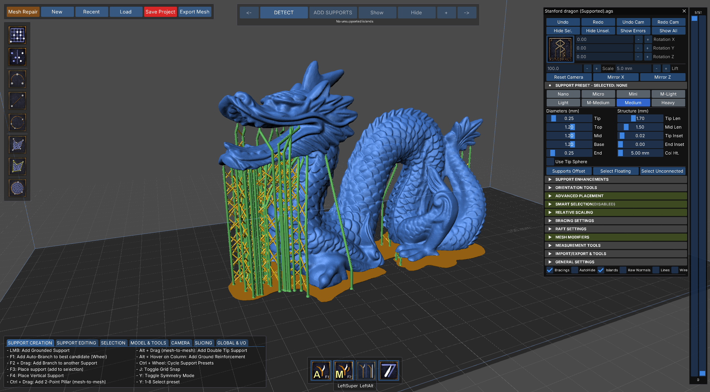
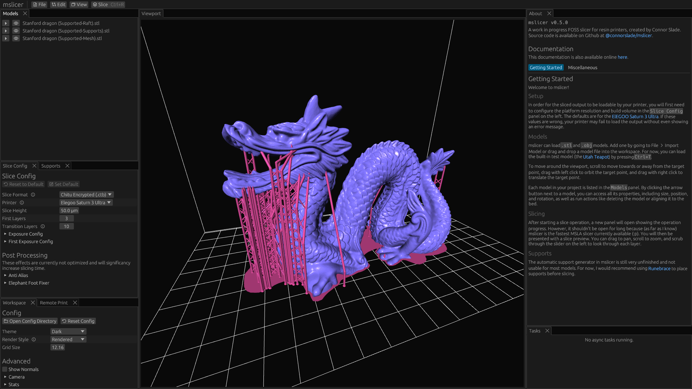

Since mslicer's automatic and manual support placement features are still under development, this is the recommended method for adding supports to models before printing.

Although not open source (and kinda slow), [Runebrace](https://www.tarabella.it/Runebrace) is an actively developed stand-alone support structure placement tool for specifically for resin printing.
You load your models into it, add supports, then export an `.stl` or `.obj` to finally slice in mslicer.

    The stanford dragon with automatically generated supports in Runebrace.

    Original model and supports loaded in mslicer.

